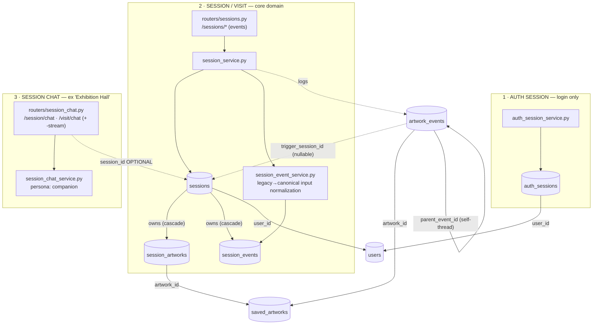

# CLAUDE.md

Project instructions for Claude Code when working with this repository.

NOTE:
Do not write new markdown files when making code changes. You should add only IMPORTANT changes to existing CHANGE_LOG.md files, other changes can be communicated through chat. The CHANGE_LOG.md is meant for AI coding assistants to prepend change logs for human developers to better keep track of.
Only if there are changes in project structure, high-level architecture, command to run the project, etc. then you update README.md.
Only create new .md files when you are asked to.

## Project Overview

Musee is a web app (React + Vite) with Python FastAPI backend for AI-powered artwork analysis.

**Frontend-web**: React + TypeScript + Vite (port 3000), hosted on Vercel
**Backend**: FastAPI + SQLAlchemy on Railway, Neon PostgreSQL (port 8000)
**AI providers**: OpenAI (default), Claude, Gemini — all behind `AIClientInterface`

Deployment topology (Vercel frontend → Railway backend → Neon DB) is documented in [DEPLOYMENT.md](DEPLOYMENT.md). See [README.md](README.md) for complete documentation.

## Quick Commands

### Backend
```bash
cd backend
uvicorn app.main:app --host 0.0.0.0 --port 8000 --reload
```

### Frontend-web
```bash
cd frontend-web
npm run dev                   # Vite dev server (port 3000)
```

## Key Files

**Frontend-web** — the web client is organized into feature domains (each with its own `components/`, `hooks/`, `lib/`, and sometimes `api/`): `app-shell/`, `artist/`, `artwork/`, `artwork-ingest/`, `auth/`, `boards/`, `capture/`, `collection/`, `guest/`, `museum/`, `profile/`, `session/`. Shared code lives in `api/`, `components/`, `lib/`, `types.ts`.
- `App.tsx` — root composition; top-level views wired via `app-shell/`
- `api/*.ts` — HTTP + SSE client modules (`analysis`, `artworks`, `chat`, `collections`, `auth`, `museums`, `journals`, …); there is no single `apiService.ts`
- `session/` — the "session/visit" domain: session chat + session workspace (hooks, lib, api). See **Session subsystems** below.
- `artwork/components/ArtworkDetailModal.tsx` — full artwork interpretation + detail panels
- `artwork/` — artwork cards, detail panels, and related hooks/lib (the live home of per-artwork UI)
- `types.ts` — shared TypeScript interfaces

**Backend**:
- `app/main.py` — FastAPI app entry + router registration
- `app/routers/` — one router per concern: `artwork_identify`, `artwork_ingest`, `artwork_library`, `artwork_metadata`, `artwork_mutations`, `artwork_utilities`, `sessions`, `session_chat`, `auth`, `auth_email`, `collection`, `journals`, `museums`, `tag`, `taste_profile`, `users`, `admin_maintenance`. (There is no longer a single `artwork.py`.)
- `app/services/` — one service per concern: `ai_service` (orchestration, prompt loading, language), `session_service`, `session_event_service`, `session_chat_service`, `auth_session_service`, the `artwork_*_service` family, plus `museum/`, `retrieval/`, `storage/` packages
- `app/services/ai_client_interface.py` — `AIClientInterface`; implementations `openai_api_client.py`, `claude_api_client.py`, `gemini_api_client.py`
- `app/database/models.py` — SQLAlchemy models (~25 tables; see **Database** below)
- `app/config/settings.py` — env-based config, API keys, DB URLs
- `app/prompts/*.txt` — editable prompts (no code changes needed)
- `app/database/bootstrap.py` + `backend/migrations/` — schema is applied on startup via bootstrap; migrations are one-off Python scripts, not a runner

## Session subsystems

"Session" names **three unrelated systems** — the single biggest source of confusion in this codebase. Quick triage: **touching login? → AuthSession. A visit's timeline? → Session. The chat? → session_chat.** Know which one you're in:

1. **AuthSession** — `auth_sessions` table, `auth_session_service.py`. Login/refresh-token sessions only. Web clients use rotating HttpOnly refresh cookies; native clients present rotating refresh tokens via `X-Refresh-Token`. Unrelated to the museum-visit Session.
2. **Session ("visit")** — `sessions` table, `session_service.py`, `routers/sessions.py`, frontend `session/`. The core domain object: a museum visit. Owns `SessionArtwork` (artworks in the visit) and `SessionEvent` (the visit timeline: user inputs, model responses, artwork results).
3. **Session chat** — `session_chat_service.py`, `routers/session_chat.py`, frontend `api/chat.ts` (`streamSessionChat`). The multi-artwork conversation about the works in a visit, **formerly called "Exhibition Hall."** The assistant persona is the *companion* (`prompts/identities/companion.txt`) — not a "curator" despite some lingering older names. Streams over `/api/session/chat-stream` (alias `/api/visit/chat-stream`); its `session_id` is optional, so it runs either attached to a Session or standalone.



**Two event tables:** `session_events` (visit timeline) and `artwork_events` (per-artwork history) are distinct.

**Endpoint vocabulary:** session events are served only under `/sessions/{id}/events` (+ `start-with-event`) — the old `/messages` URL aliases have been removed. The chat endpoint keeps `/api/session/chat` canonical with `/api/visit/chat` as a **retained back-compat alias** (both web and installed mobile apps call `/visit/chat-stream`, so the alias must stay).

**Event-type vocabulary:** responses now serialize a **single canonical** `event_type` — one of `user_input` / `message` / `artwork_result` / `model_response` — and all clients (web, mobile, `client-core`) read it. The legacy dual `type` output field has been removed from responses. `session_event_service.py` still keeps `LEGACY_TO_CANONICAL_EVENT_TYPE` + `normalize_session_event_type` to (a) derive canonical from the stored `session_events.type` column and (b) tolerate a legacy `type` on **input** (the write path still accepts it; old rows may hold legacy values). Read and write `event_type` in new code. Note the stored column is named `type` while the API field is `event_type` — same concept, different name.

## Important Notes

### Code Style
- **No hardcoded strings**: Use constants
- **Type safety**: Full TypeScript on frontend
- **File-based prompts**: Edit `.txt` files in `backend/app/prompts/`
- **Clean separation**: AI services follow the `AIClientInterface` pattern
- **Check existing code first**: Before adding params or features, verify they don't already exist

### Streaming vs Non-Streaming
- `*-stream` endpoints — **SSE streaming** (chunk → complete → metrics events)
- Non-stream endpoints — **Complete JSON response**
- Session flows stream over SSE **and persist** as they go: `session_service` writes `SessionEvent` rows and logs `ArtworkEvent`s during analysis. (The older "streaming never touches the DB" rule no longer holds — verify persistence in the specific service you're editing.)

### Database
Neon PostgreSQL (dev/prod URLs in settings), schema applied via `app/database/bootstrap.py` on startup. ~25 tables in `app/database/models.py`, including: `User`, `SavedArtwork`, `Collection`, `Tag`, `Session` / `SessionArtwork` / `SessionEvent`, `ArtworkEvent`, `AuthSession`, `Journal`, `MuseumEntity`, `ArtworkEntity`, `ArtistEntity`, `TasteProfile`, `AIUsage`, `DailyUsage`. (The old `Conversation` table has been dropped.)

## Development Tips

- Frontend hot reload: Just save files (Vite HMR)
- Backend hot reload: Uses `--reload` flag
- Edit prompts: Modify `.txt` files, restart backend (cached by prompt_loader)
- API docs: Visit `http://localhost:8000/docs`
- Test API: See README.md for curl examples

## Architecture Pattern

```python
# AI Client Interface Pattern
class AIClientInterface(ABC):
    async def analyze_artwork(...) -> AsyncGenerator[str, None]
    async def identify_artist(...) -> str

# Implementations: OpenAIClient, ClaudeClient, GeminiClient
```

Prompts loaded from files via `utils/prompt_loader.py` with caching.

## Further Documentation

- [README.md](README.md) — full architecture and setup
- [IOS_MIGRATION.md](IOS_MIGRATION.md) — long-term iOS goal, parity status, and delivery sequence
- [frontend-mobile/README.md](frontend-mobile/README.md) — implemented iOS architecture and development rules
- [DEPLOYMENT.md](DEPLOYMENT.md) — Vercel / Railway / Neon deploy topology and env vars
- [backend/API.md](backend/API.md) — backend API reference
- [BACKLOG.md](BACKLOG.md) — planned work
