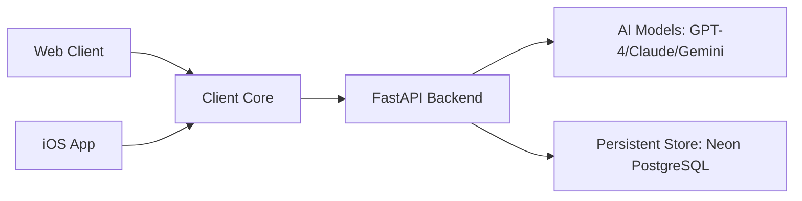

# Musee: The Future of Art Curation

Musee is an art exploration experience that uses advanced AI to identify, analyze, and discuss artwork in real-time.

## Project Overview

The project is divided into four main components:

- **[Backend](https://github.com/qinzzz/Musee/tree/main/backend)**: A FastAPI service deployed on Railway, orchestrating AI models (Gemini, OpenAI, Claude) and managing persistent curation history with Neon PostgreSQL.
- **[Web Client](https://github.com/qinzzz/Musee/tree/main/frontend-web)**: A React/Vite application deployed on Cloudflare Workers at [www.museelab.com](https://www.museelab.com), featuring an infinite "Exhibition Corridor" and batch artwork curation.
- **Mobile Client**: A new React Native + Expo iOS application under `frontend-mobile/`.
- **Client Core**: Device-agnostic TypeScript shared by both clients under `packages/client-core/`; platform UI and device integrations remain inside each app.

## Quick Start

### 1. Backend Setup
```bash
cd backend
python -m venv venv && source venv/bin/activate
pip install -r requirements.txt
cp .env.example .env.local  # Add your AI API keys and Neon DB URL
uvicorn app.main:app --reload
```

Audit finalized local days for missing journals without calling AI or writing data:

```bash
python -m app.jobs.generate_daily_journals --dry-run
```

Journal execution is opt-in via `--execute`; use `--user-id` and
`--max-journals` for controlled production pilots.

### 2. Web Client Setup
```bash
npm install
npm run web:dev
```

### 3. Mobile Client Setup
```bash
npm install
cd frontend-mobile
npx expo run:ios
```

After the native development client is installed, use `npm run mobile:start`
from the repository root for normal TypeScript/React Native iteration. Re-run
`npx expo run:ios` whenever native dependencies change.

The iOS Simulator connects to `http://127.0.0.1:8000/api` by default. For a
physical device or another backend, set `EXPO_PUBLIC_API_URL` to a reachable
API base URL before starting Expo:

```bash
EXPO_PUBLIC_API_URL=http://192.168.1.10:8000/api npm run mobile:start
```

For physical-device development, run the backend on `0.0.0.0`, use the Mac's
LAN address in `EXPO_PUBLIC_API_URL`, and keep the phone and Mac on the same
network. The mobile client intentionally rejects missing or loopback API
addresses on a physical device. Expo reads public environment variables when
Metro starts, so stop an older Metro process before changing the URL; use
`npx expo start --dev-client --clear` from `frontend-mobile/` if its cached
configuration is stale.

Preview and production builds must set `EXPO_PUBLIC_API_URL` to an HTTPS URL.
Use `EXPO_PUBLIC_APP_ENV=preview` or `production` to enable that validation;
development is the default for local builds. The committed iOS bundle ID is
`com.yujingtang.musee.dev` for reproducible development signing.

## Core Features

### Real-time Identification
Using computer vision, Musee identifies artists and artworks with high precision, providing historical context and stylistic analysis.

### Conversational Curation
Chat with your artworks. The AI Curator maintains conversation history, allowing for deep, contextual discussions about technique, meaning, and history.

### The Exhibition Corridor (Web)
An immersive, horizontal browsing experience where your curated gallery comes to life. Features batch uploading with parallel AI analysis.

### Multiple Personas
Switch between different curator identities—from academic and professional to sarcastic or poetic—to change the tone of your art exploration.

### Prompt Management
All LLM prompts are externalized for easy customization and can be found under `backend/app/prompts/`. This allows for rapid iteration on curator behavior without modifying core code.

## Technical Architecture



- **Universal AI Service**: A provider-agnostic bridge that supports OpenAI, Anthropic, and Google Gemini.
- **Streaming SSE**: Real-time analysis streaming for instant feedback.
- **Structured History**: Every conversation and analysis is stored and indexed via AI-generated tags for easy discovery.
- **Renewable Web Sessions**: The web client keeps 15-minute access tokens in memory and renews them through rotating, HttpOnly refresh cookies backed by revocable database sessions.
- **Native Session Transport**: Native clients receive rotating refresh tokens in authentication response bodies, store them in secure device storage, and present them through `X-Refresh-Token`; browser sessions remain cookie-only.
- **Persistent Native Sessions**: The iOS client writes user and model events through the shared Session contract, renders SSE responses as they arrive, and restores completed or interrupted conversations from the backend after a cold start.
- **Purpose-specific Mobile Storage**: The iOS client keeps rotating refresh credentials behind an Auth-specific SecureStore adapter; access tokens remain in memory, and UI code does not call Keychain APIs directly.
- **Credential-bound Guest Conversion**: Guest workspaces and preview quotas are proven by an HttpOnly cookie; successful authentication promotes that workspace transactionally and can resume the blocked guest action without trusting client-supplied user IDs.
- **Domain-first Web Client**: The web app is being reorganized around layers and feature domains such as `app-shell/`, `artist/`, `artwork/`, `boards/`, `session/`, `artwork-ingest/`, and `capture/`, so navigation, artist state, artwork state, board logic, session logic, ingest orchestration, and camera UX each live behind clearer boundaries instead of being scattered across flat folders.
- **Unified Museum Intake**: OSM discovery and regional Wikidata imports submit normalized candidates to one idempotent catalogue service for identity deduplication, source-aware updates, transactional persistence, and automatic post-commit thumbnail enrichment.

## Data Sources and Attribution

Museum venue footprints sourced from OpenStreetMap are stored with their source identity and license metadata. OpenStreetMap data is © OpenStreetMap contributors and available under the [Open Database License](https://www.openstreetmap.org/copyright).

Museum venue thumbnails are enriched from Wikidata `P18` and Wikimedia Commons; Musee stores the Commons source page, attribution, and license metadata alongside the cached thumbnail reference.

## Detailed Documentation

For specific setup guides and technical deep-dives:
- **[Backend README](https://github.com/qinzzz/Musee/blob/main/backend/README.md)**
- **[Web Client README](https://github.com/qinzzz/Musee/blob/main/frontend-web/README.md)**
- **[iOS Migration Plan](IOS_MIGRATION.md)**
- **[iOS Client Engineering Guide](frontend-mobile/README.md)**

---
*Built for the future of art curation.*
