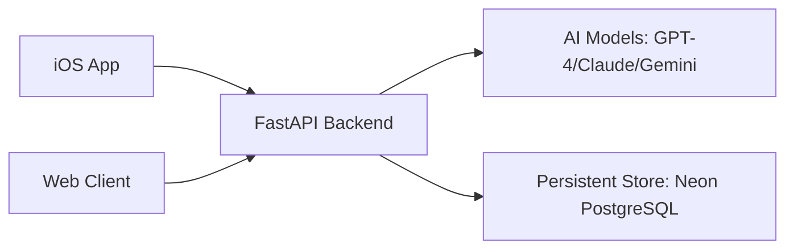

# Musee: The Future of Art Curation

Musee is a multi-platform art exploration ecosystem that uses advanced AI to identify, analyze, and discuss artwork in real-time. Whether through a premium iOS app or an immersive web experience, Musee turns any device into a personal art curator.

## Project Overview

The project is divided into three main components:

- **[Backend](https://github.com/qinzzz/Musee/tree/main/backend)**: A high-performance FastAPI server orchestrating AI models (Gemini, OpenAI, Claude) and managing persistent curation history with Neon PostgreSQL.
- **[Web Client](https://github.com/qinzzz/Musee/tree/main/frontend-web)**: A stunning, glassmorphic React/Vite application featuring an infinite "Exhibition Corridor" and batch artwork curation.
- **[iOS App](https://github.com/qinzzz/Musee/tree/main/frontend)**: A React Native mobile app for on-the-go art discovery with native camera integration.

## Quick Start

### 1. Backend Setup
```bash
cd backend
python -m venv venv && source venv/bin/activate
pip install -r requirements.txt
cp .env.example .env.local  # Add your AI API keys and Neon DB URL
uvicorn app.main:app --reload
```

Audit finalized local days for missing journals without calling AI or writing data:

```bash
python -m app.jobs.generate_daily_journals --dry-run
```

Journal execution is opt-in via `--execute`; use `--user-id` and
`--max-journals` for controlled production pilots.

### 2. Web Client Setup
```bash
cd frontend-web
npm install
npm run dev
```

### 3. iOS App Setup
```bash
cd frontend
npm install
cd ios && pod install && cd ..
npm run ios
```

## Core Features

### Real-time Identification
Using computer vision, Musee identifies artists and artworks with high precision, providing historical context and stylistic analysis.

### Conversational Curation
Chat with your artworks. The AI Curator maintains conversation history, allowing for deep, contextual discussions about technique, meaning, and history.

### The Exhibition Corridor (Web)
An immersive, horizontal browsing experience where your curated gallery comes to life. Features batch uploading with parallel AI analysis.

### Multiple Personas
Switch between different curator identities—from academic and professional to sarcastic or poetic—to change the tone of your art exploration.

### Prompt Management
All LLM prompts are externalized for easy customization and can be found under `backend/app/prompts/`. This allows for rapid iteration on curator behavior without modifying core code.

## Technical Architecture



- **Universal AI Service**: A provider-agnostic bridge that supports OpenAI, Anthropic, and Google Gemini.
- **Streaming SSE**: Real-time analysis streaming for instant feedback.
- **Structured History**: Every conversation and analysis is stored and indexed via AI-generated tags for easy discovery.
- **Renewable Web Sessions**: The web client keeps 15-minute access tokens in memory and renews them through rotating, HttpOnly refresh cookies backed by revocable database sessions.
- **Domain-first Web Client**: The web app is being reorganized around layers and feature domains such as `app-shell/`, `artist/`, `artwork/`, `boards/`, `session/`, `artwork-ingest/`, and `capture/`, so navigation, artist state, artwork state, board logic, session logic, ingest orchestration, and camera UX each live behind clearer boundaries instead of being scattered across flat folders.

## Detailed Documentation

For specific setup guides and technical deep-dives:
- **[Backend README](https://github.com/qinzzz/Musee/blob/main/backend/README.md)**
- **[Web Client README](https://github.com/qinzzz/Musee/blob/main/frontend-web/README.md)**
- **[iOS App README](https://github.com/qinzzz/Musee/blob/main/frontend/README.md)**

---
*Built for the future of art curation.*
