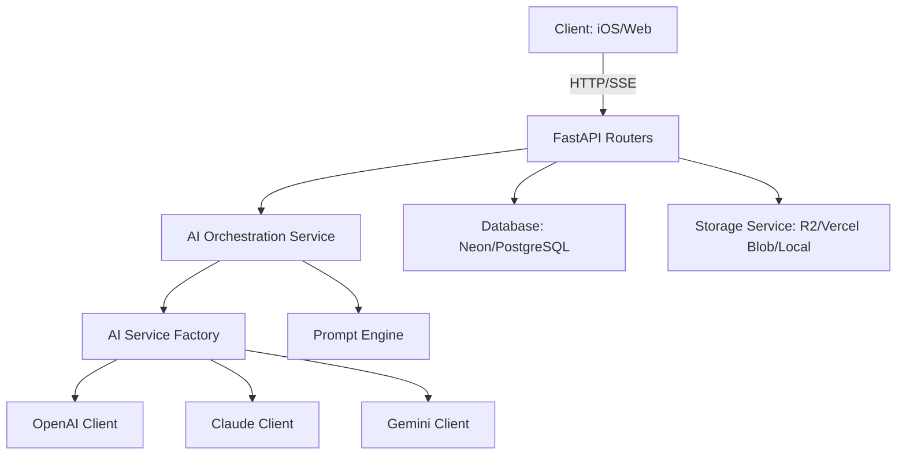

# Musee Backend Architecture

The Musee backend is a high-performance FastAPI application designed to orchestrate complex AI operations for artwork analysis, history management, and conversational art curation.

## System Architecture

The system follows a modular, interface-driven architecture to ensure scalability and easy integration of new AI providers.



### Core Modules

- **`app.routers`**: Handles API endpoints, including streaming (SSE) and standard REST requests.
- **`app.services`**: The brain of the application. 
    - `AIService`: Orchestrates prompts, image encoding, and provider-specific calls.
    - `AIClientInterface`: Polymorphic interface for all AI providers.
    - `StorageService`: Pluggable storage for artwork images.
- **`app.prompts`**: A dynamic prompt management system with support for multiple identities (personas) and languages.
- **`app.database`**: Managed via SQLAlchemy and Neon PostgreSQL for persistent storage of artworks, conversations, and tags.
- **`app.utils`**: Image processing, prompt loading, and validation utilities.

## Developer Manual

### Capture-location overrides

`PATCH /api/artworks/{artwork_id}/capture-location` accepts an authenticated owner's
explicit place selection or removal. `saved_artworks.capture_location_override`
is nullable JSON; the additive PostgreSQL schema change runs through the existing
startup bootstrap. SQL NULL preserves automatic behavior, while `status: removed`
prevents automatic reassignment. Original `location`/photo GPS is not rewritten.

Selections use `source: manual` with a user-authored name, `source: apple_maps`
with a place ID, or `source: museum` with an existing eligible museum ID. An Apple
selection may include transient name/coordinate `match_hint` evidence; only a
unique nearby exact normalized museum-name match links the existing catalogue.
Search details are not persisted or logged. Unmatched places remain personal
locations; this route does not create new shared museums. Automatic association
uses a conditional database update so in-flight results cannot overwrite a user
decision. Changing/removing a location clears the previous museum association.

Focused validation: `venv/bin/python -m pytest tests/test_capture_location.py tests/test_museum_resolution.py tests/test_artwork_mutations.py -q`.

For a standalone production schema update, inspect with
`venv/bin/python migrations/20260912_capture_location_override.py --env prod`,
then add `--apply` to execute. This targets `NEON_DATABASE_URL_PROD` explicitly,
uses bounded lock/statement timeouts, and verifies the column after commit.
It adds only nullable `capture_location_override JSONB`; no backfill is required.

### Prerequisites
- Python 3.9+
- PostgreSQL (Neon recommended)
- API Keys: OpenAI, Anthropic, or Google Gemini

### 1. Local Setup
```bash
cd backend
python -m venv venv
source venv/bin/activate
pip install -r requirements.txt
cp .env.example .env.local
```

### 2. Environment Configuration
Key variables in your `.env.local`:
- `NEON_DATABASE_URL`: Your PostgreSQL connection string.
- `AI_PROVIDER`: `gemini`, `openai`, or `claude`.
- `MAX_FILE_SIZE_MB`: Defaults to 10.
- `LOG_LEVEL`: `INFO` or `DEBUG`.
- `SECRET_KEY`: Required in production for signing short-lived access tokens.
- `AUTH_ALLOWED_ORIGINS`: Comma-separated frontend origins allowed to renew or revoke cookie sessions.
- `REFRESH_COOKIE_SECURE`: Defaults to enabled in production. Set explicitly only when deployment topology requires it.
- `REFRESH_COOKIE_SAMESITE`: Defaults to `lax`; cross-site frontend/API deployments require `none` together with secure cookies.

### 3. Running the Server
```bash
python scripts/run_dev_server.py
```
- The launcher clears stale `8000` listeners before starting `uvicorn`, which helps avoid the common local dev state where the port is occupied but the backend is not serving.
- For more stable phone/device testing, run without the file watcher:
```bash
python scripts/run_dev_server.py --no-reload
```
- **Docs**: [http://localhost:8000/docs](http://localhost:8000/docs)
- **Health**: [http://localhost:8000/health](http://localhost:8000/health)

### 4. Database Migrations
Apply the versioned database migrations before deploying:
```bash
alembic upgrade head
```

## AI Orchestration

To add a new AI provider:
1. Implement the `AIClientInterface` in `app/services/`.
2. Register the provider in `AIServiceFactory`.
3. Update `AIProvider` enum in `app/models/artwork.py`.

### Prompt personae
The system supports multiple curator identities (e.g., `default`, `professional`, `sarcastic`). These are defined in `app/prompts/identities/` and merged with instructions in `app/prompts/instructions/`.

## Deployment

The production backend runs on **Railway** and serves the Cloudflare-hosted web
client at [www.museelab.com](https://www.museelab.com). The canonical production
browser origin is `https://www.museelab.com`; keep it in
`AUTH_ALLOWED_ORIGINS`. The retained `vercel.json` is a legacy-compatible ASGI
deployment option, not the active production topology.
- **Streaming**: Uses `StreamingResponse` with SSE for real-time analysis.
- **Pooling**: SQLAlchemy is configured with `pool_pre_ping=True` and `pool_recycle=300` for stable cloud connections.

---
*Built for the future of art curation.*

## Artwork identification evaluation

`eval/run_eval.py` compares pinned GPT, Gemini, and Claude configurations, with
optional native web search or Google Vision hints. The checked-in
`eval/dataset/manifest.json` contains labels and paths relative to that directory;
place the matching images in the repository-root `dataset/` directory. Images
and generated `eval/results/` files are ignored by Git.

From `backend/`, with the backend dependencies installed:

```bash
venv/bin/python eval/run_eval.py --dry-run --configs gpt,gemini,claude
venv/bin/python eval/run_eval.py --configs gpt,gemini,claude --limit 5 --concurrency 3
venv/bin/python eval/show_vision.py co010
```

Configure the selected providers' API keys using the normal backend environment.
Export `GOOGLE_VISION_API_KEY` for Vision configurations and `show_vision.py`.
`--dry-run` prints the dataset/configuration plan without making API calls.
Results report exact, fuzzy, and substring matches for identification fields;
these are heuristic scores, not a judgment of interpretation quality. The summary
excludes failed and missing-image items; inspect per-item errors and skips in the
JSON results alongside scores.
